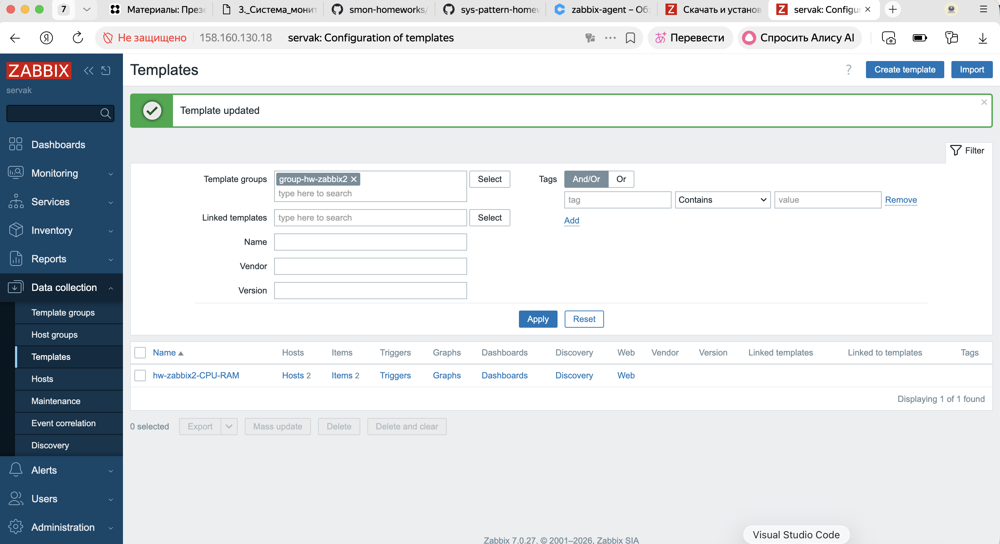
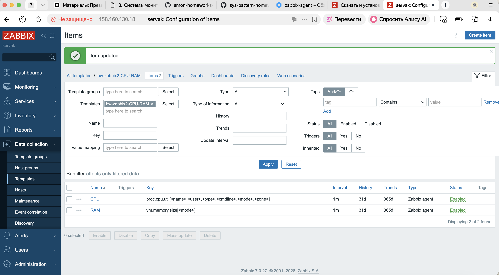
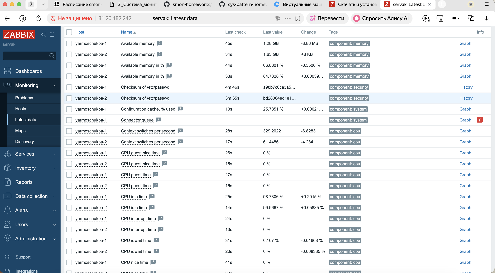
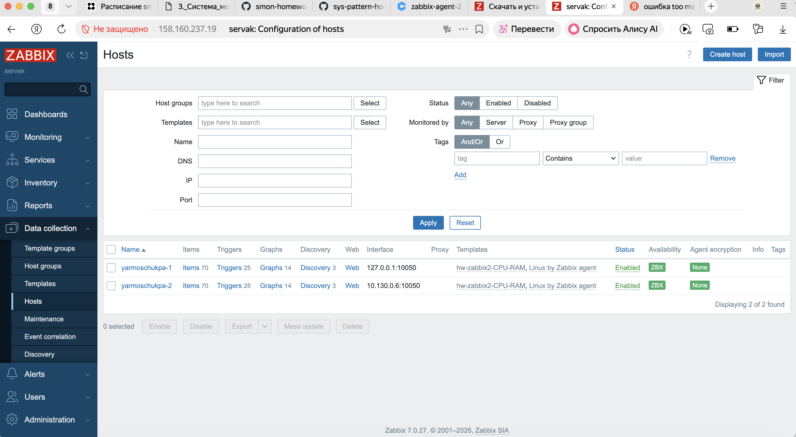
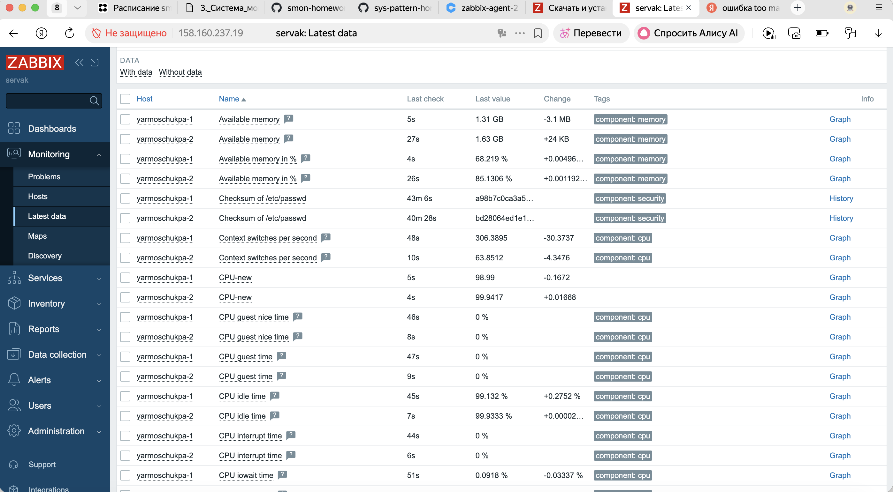
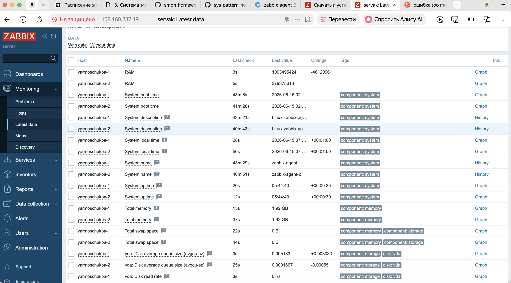
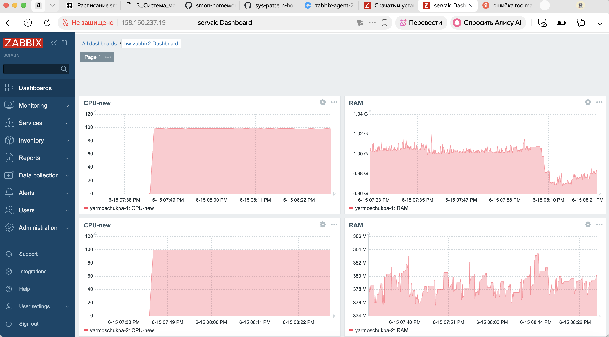

# Домашнее задание к занятию "Zabbix часть 2". Ярмощук Павел

## Задание 1. Создайте свой шаблон, в котором будут элементы данных, мониторящие загрузку CPU и RAM хоста.

Процесс выполнения
Выполняя ДЗ сверяйтесь с процессом отражённым в записи лекции.
В веб-интерфейсе Zabbix Servera в разделе Templates создайте новый шаблон
Создайте Item который будет собирать информацию об загрузке CPU в процентах
Создайте Item который будет собирать информацию об загрузке RAM в процентах

**Решение 1**

**Скрины к заданию 1**

## Задание 2. Добавьте в Zabbix два хоста и задайте им имена <фамилия и инициалы-1> и <фамилия и инициалы-2>. Например: ivanovii-1 и ivanovii-2.

Процесс выполнения
Выполняя ДЗ сверяйтесь с процессом отражённым в записи лекции.
Установите Zabbix Agent на 2 виртмашины, одной из них может быть ваш Zabbix Server
Добавьте Zabbix Server в список разрешенных серверов ваших Zabbix Agentов
Добавьте Zabbix Agentов в раздел Configuration > Hosts вашего Zabbix Servera
Прикрепите за каждым хостом шаблон Linux by Zabbix Agent
Проверьте что в разделе Latest Data начали появляться данные с добавленных агентов
Требования к результату
 Результат данного задания сдавайте вместе с заданием 3

**Решение 2**

**Скрины к заданию 2**

## Задание 3. Привяжите созданный шаблон к двум хостам. Также привяжите к обоим хостам шаблон Linux by Zabbix Agent.

Процесс выполнения
Выполняя ДЗ сверяйтесь с процессом отражённым в записи лекции.
Зайдите в настройки каждого хоста и в разделе Templates прикрепите к этому хосту ваш шаблон
Так же к каждому хосту привяжите шаблон Linux by Zabbix Agent
Проверьте что в раздел Latest Data начали поступать необходимые данные из вашего шаблона
Требования к результату
 Прикрепите в файл README.md скриншот страницы хостов, где будут видны привязки шаблонов с названиями «Задание 2-3». Хосты должны иметь зелёный статус подключения

**Решение 3**

**Скрины к заданию 3**

## Задание 4. Создайте свой кастомный дашборд.

Процесс выполнения
Выполняя ДЗ сверяйтесь с процессом отражённым в записи лекции.
В разделе Dashboards создайте новый дашборд
Разместите на нём несколько графиков на ваше усмотрение.
Требования к результату
 Прикрепите в файл README.md скриншот дашборда с названием «Задание 4»

**Решение 4**

**Скрины к заданию 4**

